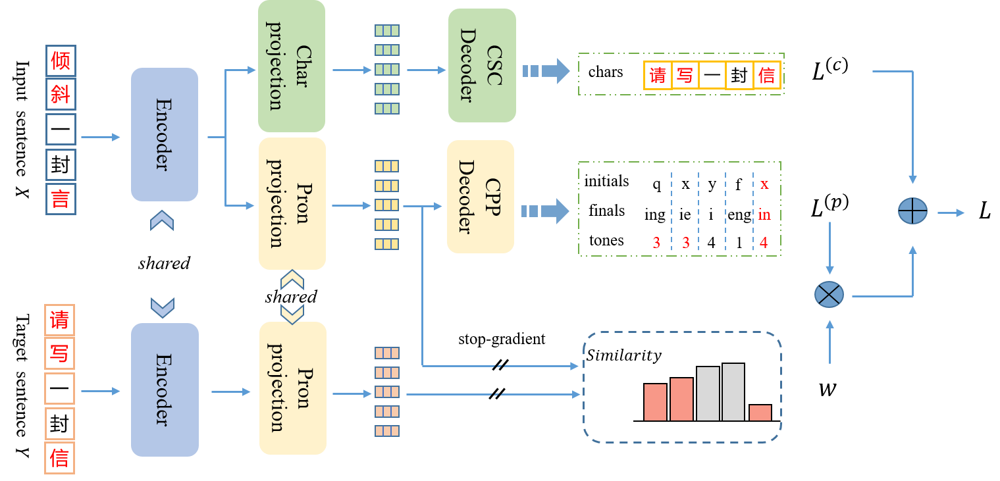

# SCOPE
Source code for the paper "Improving Chinese Spelling Check by Character Pronunciation Prediction: The Effects of Adaptivity and Granularity" in EMNLP 2022 



## Environment
- Python: 3.8
- Cuda: 11.7 (NVIDIA GeForce RTX 3090)
- Packages: `pip install -r requirements.txt`

## Data

### Raw Data
- SIGHAN Bake-off 2013: http://ir.itc.ntnu.edu.tw/lre/sighan7csc.html  
- SIGHAN Bake-off 2014: http://ir.itc.ntnu.edu.tw/lre/clp14csc.html  
- SIGHAN Bake-off 2015: http://ir.itc.ntnu.edu.tw/lre/sighan8csc.html  
- Wang271K: https://github.com/wdimmy/Automatic-Corpus-Generation
- Further pre-training corpus: https://github.com/brightmart/nlp_chinese_corpus
- Confusion set 1: http://ir.itc.ntnu.edu.tw/lre/sighan7csc.html
- Confusion set 2: http://nlp.ee.ncu.edu.tw/resource/csc.html
- Confusion set 3: https://github.com/wdimmy/Automatic-Corpus-Generation


### Data Processing
- The code for cleaning data refers to [REALISE](https://github.com/DaDaMrX/ReaLiSe).

Recommend to directly download the cleaned data from [this](https://rec.ustc.edu.cn/share/b8470c00-4884-11ed-abb5-01b9f59aa971) and put them in the `data` directory. 

- process data to the training format. 

```
python data_process/get_train_data.py \
    --data_path data \
    --output_dir data
```
## Further Pre-train

Recommend to directly download the [checkpoint](https://rec.ustc.edu.cn/share/18549500-4936-11ed-bdbb-75a980e00e16) after FPT. 

## Finetune

After the above steps are completed, modify the path parameters of the [script](https://github.com/jiahaozhenbang/SCOPE/blob/main/train.sh) and run:

`bash train.sh`

## Inference

Please modify the path parameters of the [script](predict.sh) and run:

`bash predict.sh`

## Citation

If you find this work is useful for your research, please cite our papers:

#### Improving Chinese Spelling Check by Character Pronunciation Prediction: The Effects of Adaptivity and Granularity

```bibtex
@inproceedings{li-etal-2022-improving-chinese,
    title = "Improving {C}hinese Spelling Check by Character Pronunciation Prediction: The Effects of Adaptivity and Granularity",
    author = "Li, Jiahao  and
      Wang, Quan  and
      Mao, Zhendong  and
      Guo, Junbo  and
      Yang, Yanyan  and
      Zhang, Yongdong",
    booktitle = "Proceedings of the 2022 Conference on Empirical Methods in Natural Language Processing",
    month = dec,
    year = "2022",
    address = "Abu Dhabi, United Arab Emirates",
    publisher = "Association for Computational Linguistics",
    url = "https://aclanthology.org/2022.emnlp-main.287",
    pages = "4275--4286",
    abstract = "Chinese spelling check (CSC) is a fundamental NLP task that detects and corrects spelling errors in Chinese texts. As most of these spelling errors are caused by phonetic similarity, effectively modeling the pronunciation of Chinese characters is a key factor for CSC. In this paper, we consider introducing an auxiliary task of Chinese pronunciation prediction (CPP) to improve CSC, and, for the first time, systematically discuss the adaptivity and granularity of this auxiliary task. We propose SCOPE which builds upon a shared encoder two parallel decoders, one for the primary CSC task and the other for a fine-grained auxiliary CPP task, with a novel adaptive weighting scheme to balance the two tasks. In addition, we design a delicate iterative correction strategy for further improvements during inference. Empirical evaluation shows that SCOPE achieves new state-of-the-art on three CSC benchmarks, demonstrating the effectiveness and superiority of the auxiliary CPP task. Comprehensive ablation studies further verify the positive effects of adaptivity and granularity of the task.",
}

```

